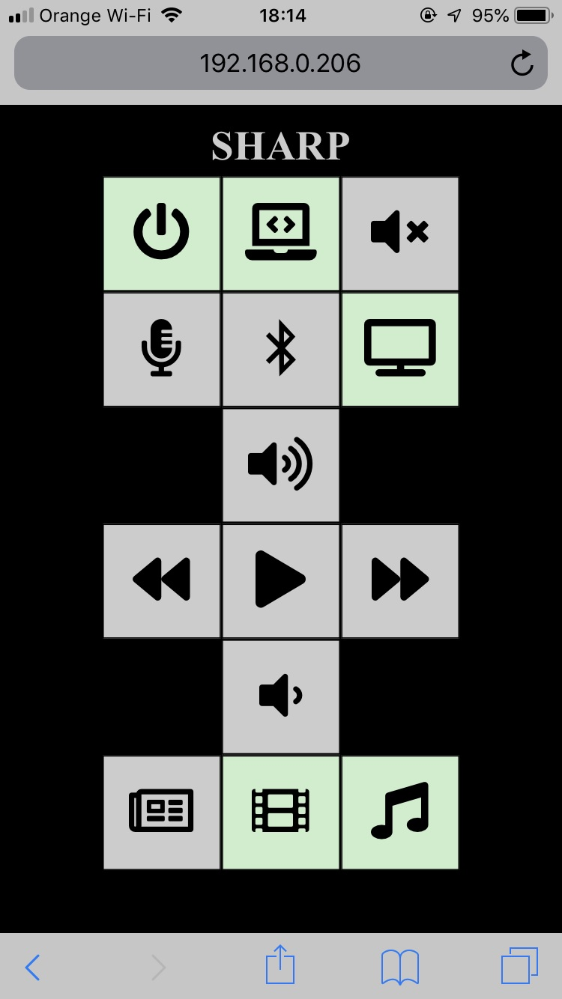

# Sharp Soundbar Remote Control Web GUI
Very simple Web GUI for controlling LIRC which controls Sharp Soundbar over infrared as provided remote control unit is very tiny.

## Adjusting for own needs / file list
* `index.html` has simple table based layout, change button names and signals (key names from lircd.conf)
* `sharp.py` has `sendToSharp(key)` which need adjusting 3rd param of `call` to reflect name of your lirc remote
* `lircd.conf` - use irrecord or browse internet
* `sharp.service` - systemd service file

## Keepalive
Sharp soundbar goes automatically to sleep which can be annoying. With keepalive function script sends volume down then wolume up signals which prevents autosleep. Enable/disable with GUI. You'll need this in cron:

```
*/2 * * * * /usr/bin/curl -s http://localhost:8080/keepalive
```

## Demo
